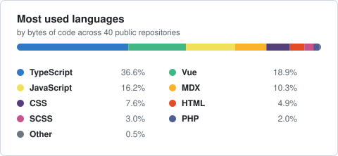

# Parsa Jiravand

  
  
  
  
  

  
  
  

---

## About me

I'm a full-stack developer working mostly in the Vue and React ecosystems. I like the unglamorous
end of the job: shrinking a dependency tree, deleting a hack that a browser API already handles,
and turning a problem I hit twice into a package other people can install once.

Two habits drive most of what you'll find on this profile:

- **A package every week.** One small, focused library — Vue, then Nuxt, then React, then vanilla
  JavaScript — each with tests, docs, and a live demo before it ships.
- **A post every day.** Short, practical write-ups on [dev.to](https://dev.to/parsajiravand),
  usually about a platform feature that quietly replaced a library everyone still installs.

I'm also contributing to **[GodPlans](https://github.com/god-plans)**, building intelligent,
user-centric planning and productivity tooling.

## Published packages

Sixteen packages on npm, around **42k downloads a month** combined. The badges below are live, so
these numbers stay current on their own.

| Package | What it does | Version | Downloads |
| --- | --- | --- | --- |
| **[vue3-form-wizard](https://www.npmjs.com/package/vue3-form-wizard)** | Tab/step wizard for Vue 3, no external dependencies |  |  |
| **[react-form-wizard-component](https://www.npmjs.com/package/react-form-wizard-component)** | Accessible React form wizard with validation and progress tracking |  |  |
| **[vue-client-recaptcha](https://www.npmjs.com/package/vue-client-recaptcha)** | Client-side captcha with no backend call |  |  |
| **[helping-js](https://www.npmjs.com/package/helping-js)** | Zero-dependency JS utilities: type guards, 50+ regex patterns |  |  |
| **[cross-framework](https://www.npmjs.com/package/cross-framework)** | Source-to-source converter: React → Vue |  |  |
| **[vue-camera-kit](https://www.npmjs.com/package/vue-camera-kit)** | Vue 3 camera component for photo and video capture |  |  |
| **[vue-advanced-screen-recorder](https://www.npmjs.com/package/vue-advanced-screen-recorder)** | Screen recording, Vue-first API |  |  |
| **[react-scroll-narrator](https://www.npmjs.com/package/react-scroll-narrator)** | Scroll-driven narration for React |  |  |

Also on npm: `vue-heic-image`, `god-kit`, `nuxt-content-stand`, `react-performance-monitoring`,
`advanced-react-role-guard`, `use-clipboard-history`, `next-dynamic-sitemap-generator`,
`simple-form-data-function` — [see all →](https://www.npmjs.com/~parsajiravand)

## Latest from dev.to

<!-- BLOG-POST-LIST:START -->- [Nobody tells you the question window is closing](https://dev.to/parsajiravand/nobody-tells-you-the-question-window-is-closing-4n40) &nbsp;Aug 25, 2026
- [JavaScript Closures: The Complete Guide &lpar;with Cheat Sheet&rpar;](https://dev.to/parsajiravand/javascript-closures-the-complete-guide-with-cheat-sheet-2p7p) &nbsp;Aug 25, 2026
- [CSS Animations Can&#39;t Pause. The Web Animations API Can.](https://dev.to/parsajiravand/css-animations-cant-pause-the-web-animations-api-can-3ncg) &nbsp;Aug 25, 2026
- [Vue Reactivity Explained: ref vs reactive &lpar;+ Cheat Sheet&rpar;](https://dev.to/parsajiravand/vue-reactivity-explained-ref-vs-reactive-cheat-sheet-4nij) &nbsp;Aug 24, 2026
- [JavaScript Proxy and Reflect: The Complete Guide](https://dev.to/parsajiravand/javascript-proxy-and-reflect-the-complete-guide-4ehf) &nbsp;Aug 24, 2026
- [The CSS Selector Built to Lose Every Fight](https://dev.to/parsajiravand/the-css-selector-built-to-lose-every-fight-4kb9) &nbsp;Aug 24, 2026
<!-- BLOG-POST-LIST:END -->

📖 [Read everything on dev.to →](https://dev.to/parsajiravand)

## Tech I work with

**Frontend**

**Styling & state**

**Backend & data**

**Build, test & tooling**

Also: VitePress for docs sites, and Vercel / GitHub Actions for shipping them.

## GitHub stats

<!-- Both cards are generated inside this repo by GitHub Actions — no third-party uptime to depend on. -->
<picture>
  <source media="(prefers-color-scheme: dark)" srcset="./assets/metrics-dark.svg" />
  <source media="(prefers-color-scheme: light)" srcset="./assets/metrics.svg" />
  
</picture>

<picture>
  <source media="(prefers-color-scheme: dark)" srcset="./assets/languages-dark.svg" />
  <source media="(prefers-color-scheme: light)" srcset="./assets/languages.svg" />
  
</picture>

<!--
  A streak card used to sit here, pointing at streak-stats.demolab.com. Removed:
  the origin answers in 27-30s and fails outright roughly two times in three, and
  GitHub's camo image proxy gives up after about 4s — so it served a permanent 504
  and rendered as a broken image. Curling the URL looks fine only because curl
  waits. Commit activity is already covered by the metrics card above.
-->

## Contribution graph

<picture>
  <source media="(prefers-color-scheme: dark)" srcset="https://raw.githubusercontent.com/parsajiravand/parsajiravand/output/github-snake-dark.svg" />
  <source media="(prefers-color-scheme: light)" srcset="https://raw.githubusercontent.com/parsajiravand/parsajiravand/output/github-snake.svg" />
  
</picture>

## Let's talk

I'm open to new opportunities, collaborations, and interesting conversations — especially about
open-source libraries and developer tooling. If you spot a bug in any of my packages or have an
idea for one, open an issue; I read all of them.

| Where | Handle |
| --- | --- |
| ✉️ Email | [parsajiravand@gmail.com](mailto:parsajiravand@gmail.com) |
| ✍️ dev.to | [@parsajiravand](https://dev.to/parsajiravand) |
| 💼 LinkedIn | [Parsa Jiravand](https://www.linkedin.com/in/parsa-jiravand) |
| 🐦 X | [@parsablk](https://twitter.com/parsablk) |
| 📦 npm | [~parsajiravand](https://www.npmjs.com/~parsajiravand) |

Thanks for stopping by. If something here saved you an afternoon, a ⭐ on the repo is always welcome.

